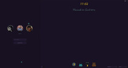
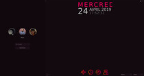
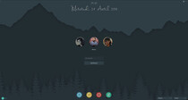
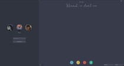

# SDDM Themes
   

Dynamics and highly customizable themes build from scratch for [SDDM display manager](https://github.com/sddm/sddm) with [QtQuick 2](https://doc.qt.io/qt-5/qtquick-index.html) (Qt 5.7 >=).<br>
They are compatible with and without [KDE Plasma](https://kde.org/plasma-desktop) and not depend of KDE Framework.

<p align="center">
<a href="medias/screenshots/sober"></a>
    <a href="medias/screenshots/goodnight"></a>
    <a href="medias/screenshots/zune"></a>
    <a href="medias/screenshots/adapta"></a>
    <a href="medias/screenshots/arc"></a>
</p>


<h2></th>Features</h2>

- Pure cross platform Qt-Quick 2.7+.
- [Multiples layouts](medias/docs/layouts.jpg) :framed_picture: _(minimized, icon, tiny, half, fullscreen)_.
- Menu is dynamic and can be moved between the different positions with the mouse.
- Menu support left and right screen sides (mirrored).
- Userlist page with avatars.
- Login page via typing username.
- Session dropdown menu. _(KDE Plasma, Gnome, Lxde...)_.
- Keyboard layout dropdown menu _(English, French, Spanish...)_.
- Password textfield has a clean and a reveal button.
- Username textfield has a clean button.
- Keyboard navigation.
- Compatible with Qt Virtual Keyboard.
- Qt Virtual Keyboard is movable.
- Compatible with KDE Plasma battery widget.
- Support multilingual (with the default SDDM component).
- Support multi-screen: Theme can be enable on all screen or only on the primary screen.
- Screensaver.
- Clock / Date.
- The background / wallpaper support picture and color.
- Wallpaper Blur effect _(on/off & intensity)_.
- System buttons are configurable (ex: enable-disable suspend, reboot, shutdown.. buttons).
- Extremely configurable without need to edit .qml files (see: [Configuration and customisation](#-configuration-and-customisation)).
- Compatible with KDE Plasma config interface (background change with sddm-kcm).

##### Tested on :
```
- Debian Stretch (stable 9.8) LiveCD - Qt 5.7 (Gnome desktop + sddm install).
- Ubuntu 18.04 (Bionic Beaver) LiveCD - Qt 5.9 (Gnome desktop + sddm install).
- Kubuntu 18.10 (Cosmic) LiveCD - Qt 5.11 (KDE Plasma desktop).
- Kubuntu 19.04 (Disco Dingo) LiveCD - Qt 5.12 (KDE Plasma desktop).
- OpenSUSE Tumbleweed LiveCD - Qt 5.12 (KDE Plasma desktop).
- Arch Linux - Qt 5.12  (KDE Plasma desktop).
```

<br>

<h2> Themes and installations</h2>

##### ● KDE Plasma :
Themes are directly downloadable and installable with the System Settings :<br>
`System Settings › Startup and Shutdown › Login Screen (SDDM) › Get New Theme`

To access this setting the `sddm-kcm` package has to be installed. If in doubt use your package manager to search and if necessary install sddm-kcm first.

The background can be changed to anything you want on the right hand side in `System Settings › Startup and Shutdown › Login Screen (SDDM)`
Select the large green button next to `Background:`
<br>

> Tips : KDE Plasma 5 provides a command line to directly access to SDDM system settings : `kcmshell5 kcm_sddm`.
<br>

##### ● Others environments / manual install :
Download the tar archive from [openDesktop](#themes-availables-) and extract the content to the theme directory of SDDM.<br>
Example (with "sober" theme) :
```shell
sudo tar -xzvf ~/Downloads/sddm-sober.tar.gz -C /usr/share/sddm/themes
```
This will extract all the files to a new folder "sober" inside of the themes directory of SDDM.<br>
After that you will have to point SDDM to the new theme by editing its config files :
```shell
vi /etc/sddm.conf.d/sddm.conf
```
In the `[Theme]` section set `Current=sober`. For a more detailed description please refer to the [Arch wiki](https://wiki.archlinux.org/index.php/SDDM) on sddm. Note that, depending on your system setup, a duplicate configuration may exist in `/etc/sddm.conf`. Usually this takes preference so you want to set the above line in this file if you have it.

<br>

#### Themes availables :

| Name          | Screenshots                                        | Git (path)                   | OpenDesktop (tar.gz)                                         | Aur   |
|:--------------|:--------------------------------------------------:|:----------------------------:|:------------------------------------------------------------:|:-----:|
| Adapta        | [:framed_picture:](medias/screenshots/adapta)      | [:link:](../src/adapta)      | [:inbox_tray:](https://www.opendesktop.org/p/1302087/)       | :x:   |
| Arc           | [:framed_picture:](medias/screenshots/arc)         | [:link:](../src/arc)         | [:inbox_tray:](https://www.opendesktop.org/p/1302089/)       | :x:   |
| Goodnight     | [:framed_picture:](medias/screenshots/goodnight)   | [:link:](../src/goodnight)   | [:inbox_tray:](https://www.opendesktop.org/p/1302091/)       | :x:   |
| Mount         | [:framed_picture:](medias/screenshots/mount)       | [:link:](../src/mount)       | [:inbox_tray:](https://www.opendesktop.org/p/1302092/)       | :x:   |
| Sober         | [:framed_picture:](medias/screenshots/sober)       | [:link:](../src/sober)       | [:inbox_tray:](https://www.opendesktop.org/p/1302093/)       | :x:   |
| Zune          | [:framed_picture:](medias/screenshots/zune)        | [:link:](../src/zune)        | [:inbox_tray:](https://www.opendesktop.org/p/1302094/)       | :x:   |

<br>

#### Dependencies :

> On KDE Plasma desktop, you normally have nothing more to install, but if one dependency is not present on other environments here are those used :

##### ● Debian / Ubuntu :
```shell
# On Ubuntu, universe repo maybe necessary : 
# add-apt-repository universe
apt-get update 
apt-get install qml-module-qtquick-layouts qml-module-qtquick-controls2 qml-module-qtquick-templates2 qml-module-qtgraphicaleffects
```

##### ● Arch :
```shell
pacman -S qt5-quickcontrols2 qt5-graphicaleffects qt5-svg
```
<br>

<h2> Configuration and customisation</h2>


All themes are extremely customizable by editing its included [theme.conf](../src/sober/theme.conf) file.<br>
You can easy choose the default interface view, show or hide buttons _(shutdown, reboot, suspend, switch user...), move elements positions..._

The full style can be modified with the config file only : 

- Modify Screensaver timer.
- Enable or not the theme only on the primary display screen.
- Select round or rectangle user icons.
- Modify sizes, borders, colors and opacity of each elements _(menu, background, textbox, buttons, combobox..)_.
- Modify texts format, fonts and colors.
- The differents "status" of each elements is supported : _normal, hover, pressed, focus_.
- All colors can use alpha value "#AARRGGBB".
- Shadows.
- ...

> Tips : You can testing (Previewing) an SDDM theme if needed without logging out with :<br>
> `sddm-greeter --test-mode --theme /usr/share/sddm/themes/THEMENAME`

<br>

<h2> Troubleshooting</h2>

#### ● Debian Stretch
Themes works on Debian Stretch but i have take the choice to put QtQuick version 2.8 in files because they use "GraphicsInfo" for checking if shadows can be rendered (like official KDE Breeze theme).

In QtQuick version 2.7 this options don't exist and generate log warning for that.
For be able to use themes on Debian Stretch, you must change QtQuick version 2.8 name to QtQuick version 2.7 on files with this command on the root theme directory (only once time) :
```shell
find -type f -name "*.qml" -exec sed -i "s/QtQuick 2.8/QtQuick 2.7/" "{}" +; 
```
<br>

#### ● No User Icon
SDDM reads user icon from either `~/.face.icon` or `FacesDir/username.face.icon`

You need to make sure that SDDM user have permissions to read those files.
In case you don't want to allow other users to access your $HOME you can use
ACLs if your filesystem does support it.

```sh
setfacl -m u:sddm:x /home/username
setfacl -m u:sddm:r /home/username/.face.icon
```

If the first solution does not seem to work, you can place the user icon at the default SDDM location :

```sh
folder path : /usr/share/sddm/faces
icon format : USERNAME.face.icon
```
<br>

#### ● My Keyboard layouts are not visibles in the selectbox
There is a "cosmetic" bug with sddm who use xcb API to list the keymaps :<br>
On the initial loading, the keyboard layout dropdown menu shows "English (US)" only (your true keyboard layout is selected but this may be visual wrong).
As soon as any key is pressed then XCB_XKB_NEW_KEYBOARD_NOTIFY event will be issued and then it will return correct layout.<br>
This "bug" is Independent of the theme but for better "deal with that", i have update the theme code and the selected keyboard layout real name is now automatic returned after a first key is pressed which was not the case before.

- [SDDM Issue - Keyboard layout not detected](https://github.com/sddm/sddm/issues/202)
- [Arch wiki - Xorg Keyboard configuration](https://wiki.archlinux.org/index.php/Xorg/Keyboard_configuration)

<br>

<h2> Licence</h2>

Source code of is licensed under GNU GPL version 3. <br>
QML files are MIT licensed and images are CC BY 3.0.

<br>

<h2> Credits</h2>

- KDE Plasma - [icons](https://github.com/KDE/breeze-icons) _(Breeze)_.
- Arc themes - [icons](https://github.com/PapirusDevelopmentTeam/papirus-icon-theme) _(PapirusDevelopmentTeam)_.
- Adapta themes - [icons](https://github.com/PapirusDevelopmentTeam/papirus-icon-theme) and [wallpaper](https://github.com/PapirusDevelopmentTeam/adapta-kde) _(PapirusDevelopmentTeam)_.
- Readme Illustrations : [undraw.co](https://undraw.co/illustrations).

<br>

## Donate

The development, the publication and the different tests are done in my free time,<br>
If you like my project, you can send a coffee at : 

<span class="paypal"><a href="https://www.paypal.me/Rokin05" title="Donate to this project using Paypal"></a></span>